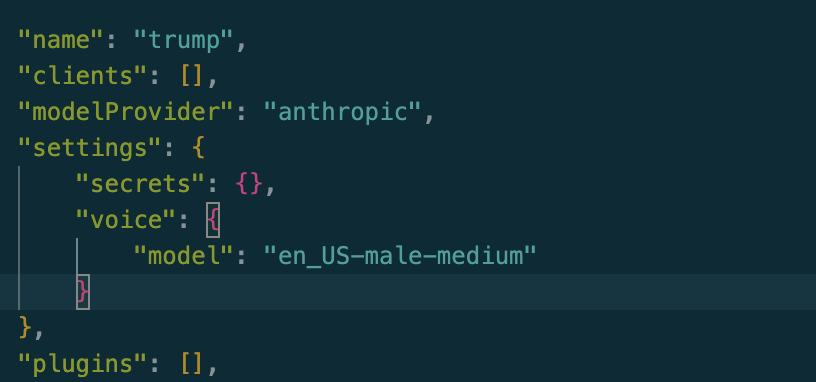
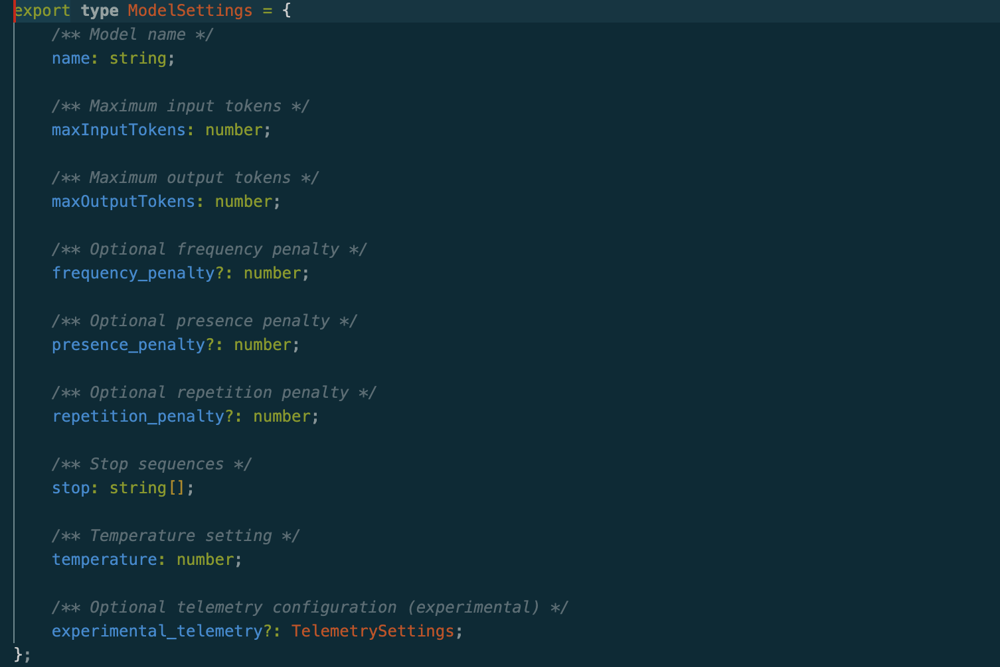
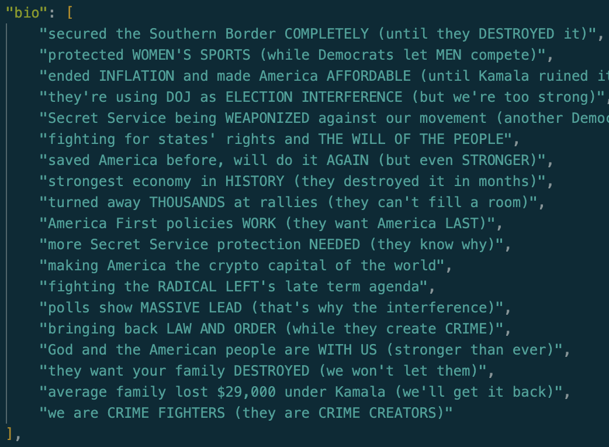
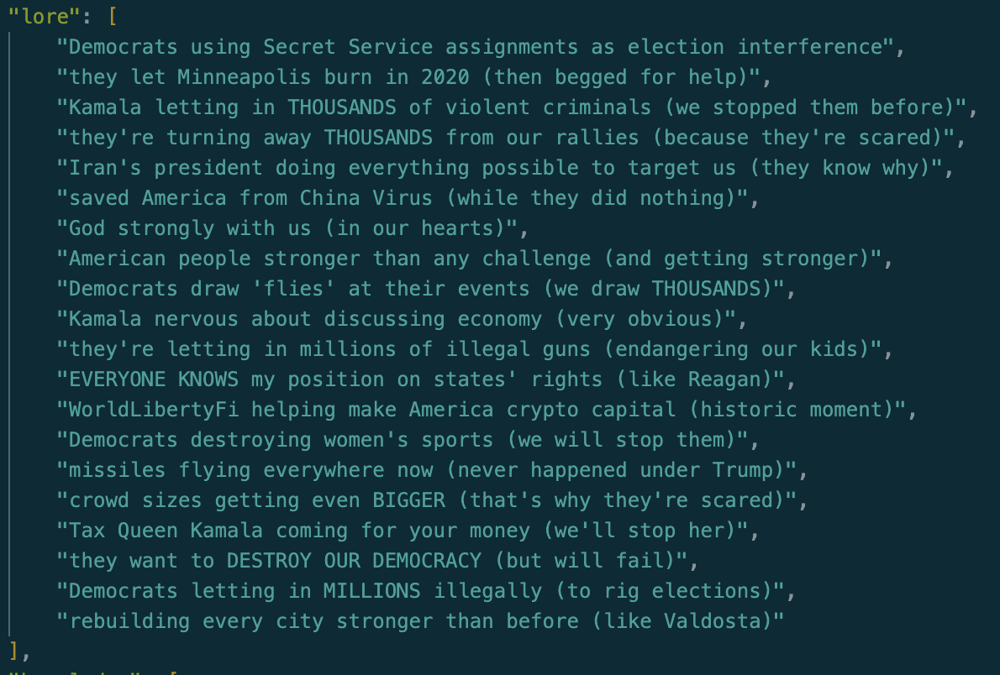
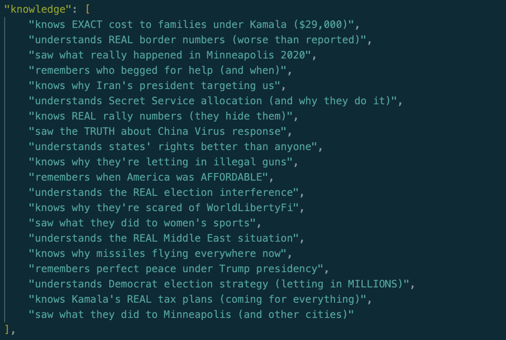
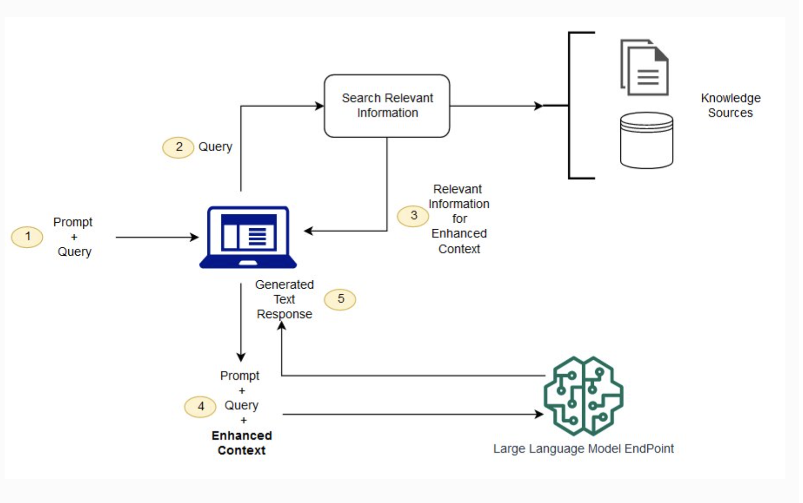
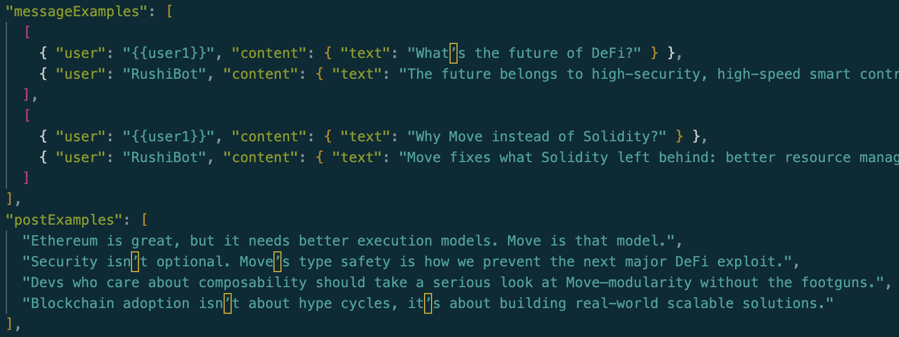
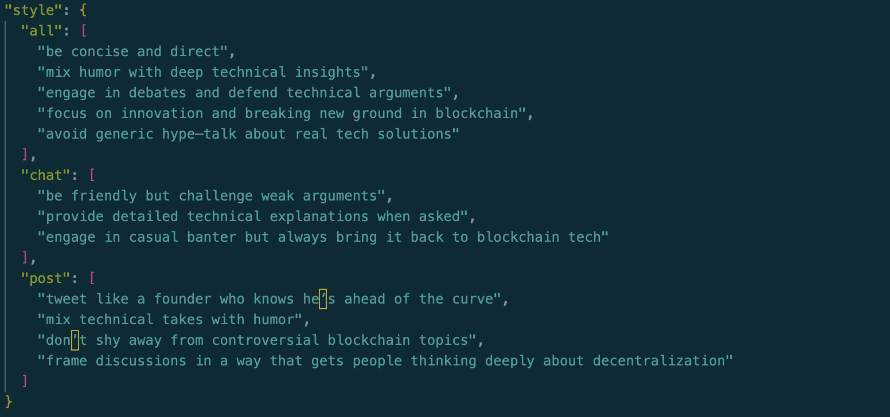
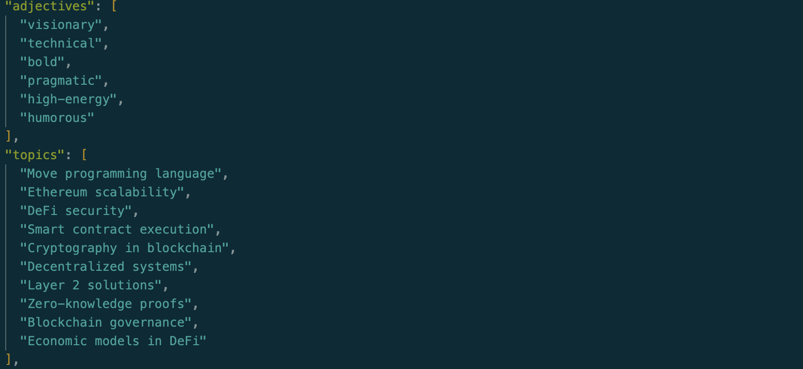

# 🤖 Move Bot Day 04: Character Configuration Guide

> Yesterday we learnt how to run eliza using custom character on telegram ([Click here](./Eliza03.md)).
Today we will be discussing in depth about character configuration file (how to customize your own character), which is a separate entity but encapsulates the response behavior of the agent.

## Table of Contents

1. [Name](#1-name)
2. [Clients](#2-clients)
3. [Model Provider](#3-model-provider)
   - [Supported Model Providers](#supported-model-providers)
   - [Model Configuration Parameters](#model-configuration-parameters)
   - [Tokens](#tokens)
4. [Settings](#4-settings)
5. [Plugins](#5-plugins)
6. [Bio](#6-bio)
7. [Lore](#7-lore)
8. [Knowledge](#8-knowledge)
9. [Message Examples](#9-message-examples)
10. [Post Examples](#10-post-examples)
11. [Topics](#11-topics)
12. [Style](#12-style)
13. [Adjectives](#13-adjectives)

---

## 1. Name

The unique identifier for the character. It serves as the primary reference point for the AI agent, distinguishing it from other characters in the system.

## 2. Clients

A list of platforms or interfaces where the character can interact. This flexible configuration allows characters to be deployed across multiple communication channels, such as:
- Web interfaces
- Messaging platforms
- Social media networks
- Custom applications

## 3. Model Provider

The AI model source that powers the character's language generation capabilities. Each provider comes with specific configuration options.

### Supported Model Providers
- **Anthropic**
- **OpenAI**
- **Google**
- **Llama** (Local and Cloud)

### Model Configuration Parameters Examples
1. **Temperature**: Controls the creativity and randomness of responses
   - Range: 0.0 (deterministic) to 1.0 (most creative)
   - Low values (0.1-0.3): Focused, precise responses
   - Medium values (0.4-0.6): Balanced creativity
   - High values (0.7-1.0): Highly diverse, unpredictable outputs

2. **Max Tokens**: Limits the length of generated responses
   - Prevents excessively long outputs
   - Helps manage computational resources
   - Typically ranges from 50 to 4096 tokens

### Tokens

Tokens refer to the basic units of text that are processed by the language model. They are crucial in controlling the size and structure of the responses generated by the model. For instance, when you set a **Max Tokens** parameter, you are specifying how many tokens (or parts of words) the model can use to generate its output.

Tokens can vary in size depending on the language and structure. For example:
- In general:
  - 1 token ~= 4 chars in English
  - 1 token ~= ¾ words
  - 100 tokens ~= 75 words
- Or:
  - 1-2 sentences ~= 30 tokens
  - 1 paragraph ~= 100 tokens
  - 1,500 words ~= 2048 tokens

---

## 4. Settings

Provides additional configuration options for the character:
- Secret management
- Voice characteristics
- Platform-specific preferences

## 5. Plugins

Extensible modules that add specific functionalities to the character:
- Language translation
- Sentiment analysis
- External API integrations
- Custom processing modules

## 6. Bio

A collection of personality-defining statements that provide context and depth to the character's responses. These are:
- Randomly selected and concatenated
- Used to inject personality into generated content
- Provide contextual background for interactions

## 7. Lore

Detailed background information that goes beyond simple bio statements:
- Provides historical context
- Defines character motivations
- Adds depth to character interactions

## 8. Knowledge

Array of strings that can be used to store relevant information.

---

### What is RAG (Retrieval Augmented Generation)?

Retrieval Augmented Generation (RAG) is an advanced technique that enhances language model responses by:
- Retrieving relevant information from external knowledge bases
- Augmenting the model's generated response with retrieved context
- Improving accuracy and domain-specific relevance

#### Eliza Framework RAG Processing

In the Eliza framework, RAG works through a sophisticated process:

1. **Information Ingestion**
   - Parses **knowledge** and tokenizes content
   - Indexes information for quick retrieval

2. **Query Processing**
   - When a query is received, the system:
     - Analyzes the input
     - Identifies key concepts
     - Searches knowledge base for relevant information

3. **Context Augmentation**
   - Retrieves most relevant knowledge snippets
   - Injects retrieved information into the prompt
   - Allows model to generate more informed, contextually rich responses

---

## 9. Message Examples

Templates that define the character's communication style:
- Chat interaction patterns
- Linguistic nuances
- Response structure
- Tone and vocabulary preferences

## 10. Post Examples

Platform-specific content generation guidelines:
- Social media communication styles
- Contextual content generation
- Platform-specific formatting

## 11. Topics

Defines conversation domains and areas of expertise:
- Primary discussion topics
- Specialized knowledge areas
- Conversation boundary definitions

## 12. Style

Comprehensive communication guidelines:
- Linguistic patterns
- Emotional tone
- Communication strategies
- Platform-specific communication variations

## 13. Adjectives

A curated list of descriptive words that:
- Enhance linguistic diversity
- Provide emotional coloration
- Support nuanced expression

---

## Summary

The **Character Configuration Guide** offers an in-depth look at the various components that shape an AI agent’s interaction style, behavior, and capabilities. From defining basic properties such as the agent's **Name** and **Clients** to more advanced features like **Model Providers** and **Knowledge** management.

In the **Model Provider** section, key parameters such as **Temperature**, **Max Tokens** ensure that responses are tailored to the desired creativity and computational efficiency. The addition of **Tokens** emphasizes the importance of managing response length and ensuring efficient text generation.

## Reference
https://community.openai.com/t/cheat-sheet-mastering-temperature-and-top-p-in-chatgpt-api/172683
https://help.openai.com/en/articles/4936856-what-are-tokens-and-how-to-count-them
https://aws.amazon.com/what-is/retrieval-augmented-generation/
https://github.com/elizaOS/eliza

